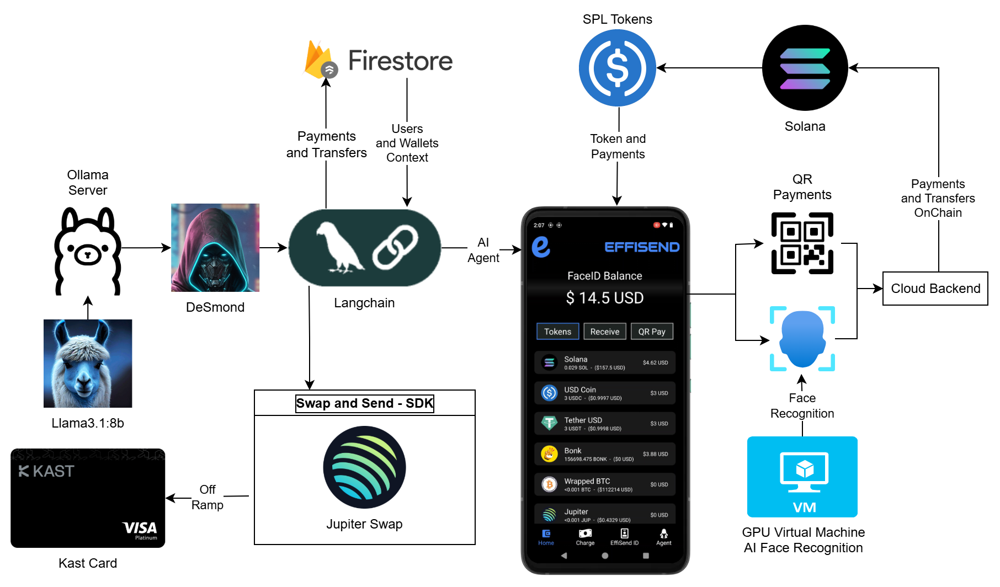
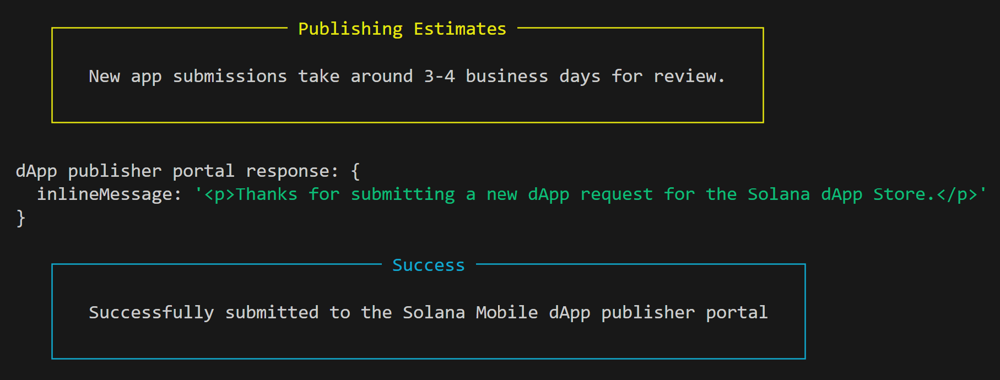

# EffiSend-SolanaMobile
EffiSend is an identity and payments platform powered by Solana

## ⚡Fast Links:

### OF course we are MOBILE FIRST!

dApp Store APK: [LINK](https://1drv.ms/u/c/cd37f27a646d3078/EdTA_mkOi3NCjbpH4PeGDPQBcy3oQGGKTG8Y3NXOtTp5pA?e=fqreLc)

We have the APK and applied to the Dapp store already!

Current [Status](https://github.com/altaga/EffiSend-SolanaMobile/blob/main/README.md#dapp-store) 

### Misc:

PITCH DECK: [LINK](https://docs.google.com/presentation/d/1TTnpSJ9s_kjioQ8f1ceWbHCEwSje5JBnt04r5IGJuc4/edit?usp=sharing)

VIDEODEMO: [LINK](https://youtu.be/3dqDYvcpe90)

## 🚀 System Diagram

EffiSend is built entirely from scratch to leverage the most advanced web3 infrastructure.



- [**BONK**](https://bonkcoin.com/): 
is a utility token that empowers users to interact with Solana's decentralized services and rewards distribution.
  - [CODE](./Cloud%20Functions/sendRewards.js) 

- [**Solana**](https://solana.com/): 
Serves as the main blockchain powering EffiSend transactions and rewards distribution. This chain offers massive scalability, low fees, and fast transaction finality, making it ideal for scalable token transfers and automated operations tied to BONK.
  - [CODE](./Cloud%20Functions/cardTopUp.js)

- [**Langchain (AI Agent)**](https://lanchain.com/): 
This framework enables us to create our agent system and its interaction with the user through DeSmond. It allows EffiSend to facilitate Solana native transfers, perform an off-ramp to our Kast card.
  - [CODE](./Agent/index.js)

- [**DeepFace**](https://viso.ai/computer-vision/deepface/): 
DeepFace is used to enhance facial recognition capabilities with real-time verification and anti-spoofing features. By cross-validating identity against secure embeddings, it boosts biometric reliability, ensuring that wallet access and reward claiming remain both frictionless and secure.
  - [CODE](./FaceID/main.py)


## Dapp Store 

This is the information of the Dapp configuration file.
```yaml
app:
    name: EffiSend
    address: CsQqAQUBC3coqXPvKDXST8ynwMM1fmEBiUTaZGa4xafH
    android_package: com.altaga.effisend.solanamobile
```

The Dapp Store CLI will display the following information after submitting.


